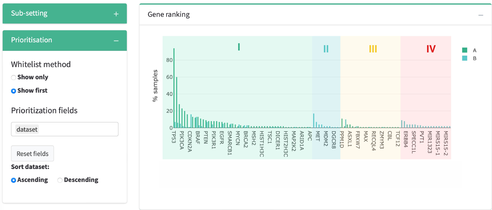

# carveR 

A shiny dashboard for building virtual gene panels from cancer variants prioritisation.

## Licensing

carveR source code is provided under the [GPLv3](https://github.com/CCICB/introme/blob/master/LICENSE) license. carveR uses R, shiny and other open source packages, please see PKGINFO for additional details.

## Overview

## Inputs

### Datasets

Users can upload up to 3 different datasets, selecting multiple files for each dataset. Different datasets are not required to share all types of molecular alterations.

> **TIP** For improved performance we suggest defining the dataset name before uploading the files.

Format requirements All data files should be in tab-separated files with .tsv extension. Regardless of the variant type, all should contain the following columns:

| gene | sample_id |
|------|-----------|
| TP53 | S0001     |

Any additional column (text or numeric) can be included to be used for gene prioritisation.

Additional requirements for each variant file are:

#### SNV files

| gene | sample_id | chr   | pos     | ref | alt | consequence      |
|------|-----------|-------|---------|-----|-----|------------------|
| TP53 | S0001     | chr17 | 7578211 | C   | T   | missense_variant |

#### CNV files

| gene | sample_id | avecopynumber |
|------|-----------|---------------|
| TP53 | S0001     | -0.72         |

#### SV files

| gene | sample_id | start_fusion | end_fusion | sv_type |
|------|-----------|--------------|------------|---------|
| ETV6 | S0001     | ETV6         | NTRK3      | BND     |

### Gene list filters (whitelist/blacklist)

Format should be one gene per row.

No header should be present, the first row should already contain a gene name. Example:

|        |
|--------|
| TP53   |
| ETV6   |
| NTRAK3 |
| RUNX1  |
| BRAF   |

Once a gene list is uploaded as a file, pasted or typed it can be dynamically edited by typing the gene to alter and then clicking **Add** or **Delete**.

## Prioritisation

### Gene list filters

#### **Whitelist**

-   **Show only:** By setting this option in the Dashboard prioritisation menu (bottom left), genes not present in the whitelist will be filter out. 

-   **Show first:** By setting this option in the Dashboard prioritisation menu (bottom left),, genes in the whitelist will be prioritised over all other prioritisation variables (see Ranking customisation in this page for more information). 

#### **Blacklist**

If a blacklist is provided, genes in the blacklist will be automatically filtered out. [somaticFlags](https://github.com/CCICB/somaticflags) can be used as blacklist of frequently mutated genes in somatic cancer datasets unlikely to drive disease.

### Ranking customisation

#### **Sub-setting menu**

**Datasets** and **variant types** can be sub-set using the checkboxes in the sub-setting menu. \
\
The maximum number of diplayed genes can be modified by toggling **Set max gene number** . When activated, the barplot will only display the top N genes in the ranking (default=200). This threshold will not affect the table below. For datasets with more than 500 genes, it will automatically toggled. 

#### **Prioritisation menu**

Prioritisation menu allows to select the preferred method for **gene whitelist** (see previous section) and include any other **prioritisation field** from the original data. 

The order in which prioritisation fields are included will determine their relative importance.

A radio button will appear for each prioritisation field, to determine wether the variable should be prioritised in Ascending or Descending order.

As the ranking is provided at gene level, for variant-specific prioritisation fields the highest scoring variant for each gene according will be taken into account.

## Outputs

### Frequency dashboard

Genes will appear ranked first by frequency, then by presence in the whitelist (if provided) and finally by all the prioritisation fields provided in the corresponding order.

See the following example:

-   **I:** First priority genes will be the ones in the whitelist list present in cohort A.
-   **II:** Second priority genes will be the ones in the whitelist list present only in cohort B (not seen in cohort A).
-   **III:** Third priority genes will be the ones NOT in the whitelist list present in cohort A.
-   **IV:** Forth priority genes will be the ones NOT in the whitelist list present only in cohort B (not seen in cohort A).

### Gene dashboard

Gene view allows to explore at variant level within each gene.

Variant consequence is extracted directly from consequence field for SNVs, from the sv_type field for SV and calculated from the avecopynumber for CNVs.
