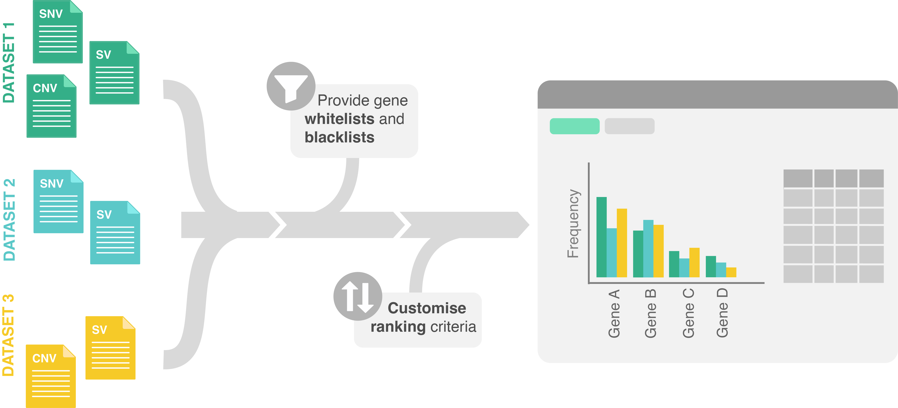
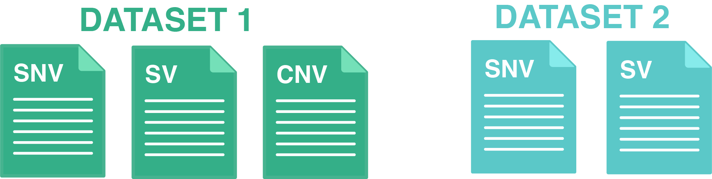

# carveR 

## Description

A shiny dashboard for building virtual gene panels from cancer variants prioritisation.

## Inputs

### Datasets

Users can upload up to 3 different datasets, selecting multiple files for each dataset. Different datasets are not required to share all types of molecular alterations.

{width="250"}

| TIP For improved performance we suggest defining the dataset name before uploading the files.

Format requirements All data files should be in tab-separated files with .tsv extension. Regardless of the variant type, all should contain the following columns:

| gene | sample_id |
|------|-----------|
| TP53 | S0001     |

Any additional column (text or numeric) can be included to be used for gene prioritisation.

Additional requirements for each variant file are:

#### SNV files

| gene | sample_id | chr    | pos     | ref | alt | consequence      |
|------|-----------|--------|---------|-----|-----|------------------|
| TP53 | S0001     | chr17  | 7578211 | C   | T   | missense_variant |

#### CNV files

| gene | sample_id | avecopynumber |
|------|-----------|---------------|
| TP53 | S0001     | -0.72         |

#### SV files

| gene | sample_id | start_fusion | end_fusion | sv_type |
|------|-----------|--------------|------------|---------|
| ETV6 | S0001     | ETV6         | NTRK3      | BND     |
